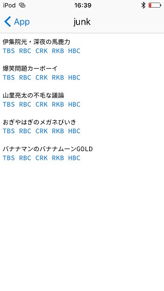

# radiko
Easy access to programs on [radiko.jp](http://radiko.jp/) (onoffcial).



## Install
1. Setup [RubyPicoGems](https://github.com/rubypico/RubyPicoGems)
2. Run `github_downaload.rb`
3. Download `radiko`

or 

Create `radiko` directory and copy to scripts.
 
## Usage
- junk.rb .. Easy access to 'TBSラジオ JUNK'
- ann.rb .. Easy access to 'オールナイトニッポン'
- radiko.rb .. Libraries

## Create Your Favorite Program

```ruby
# coding: utf-8
require "radiko/radiko"
include Radiko

c "山下達郎のサンデー・ソングブック", "Sun 14:00", %w(FMT RADIONERRY FMO E-RADIO FMAICHI FMGIFU)
c "ライムスター宇多丸のウィークエンドシャッフル", "Sat 22:00", %w(TBS RAB YBC RBC)
c "菊地成孔の粋な夜電波", "Sun 20:00", %w(TBS IBC YBC RFC BSN)
```

